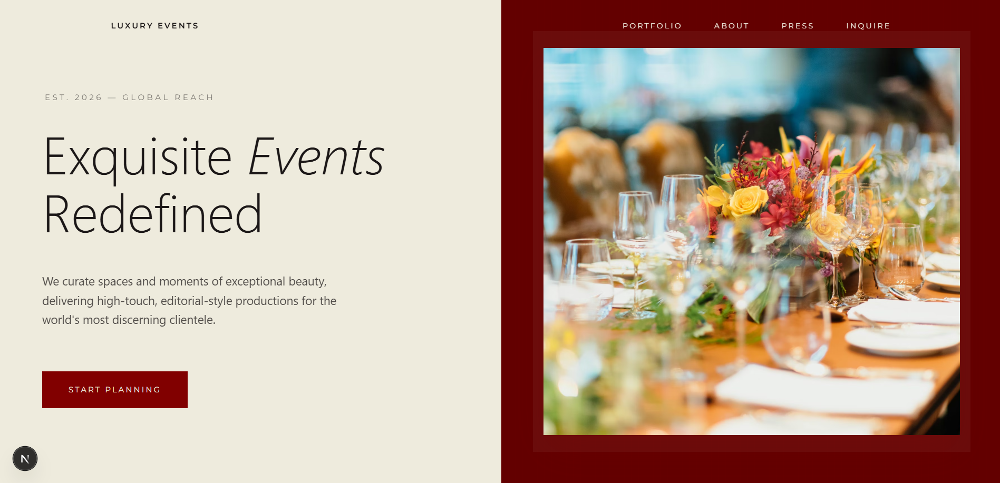
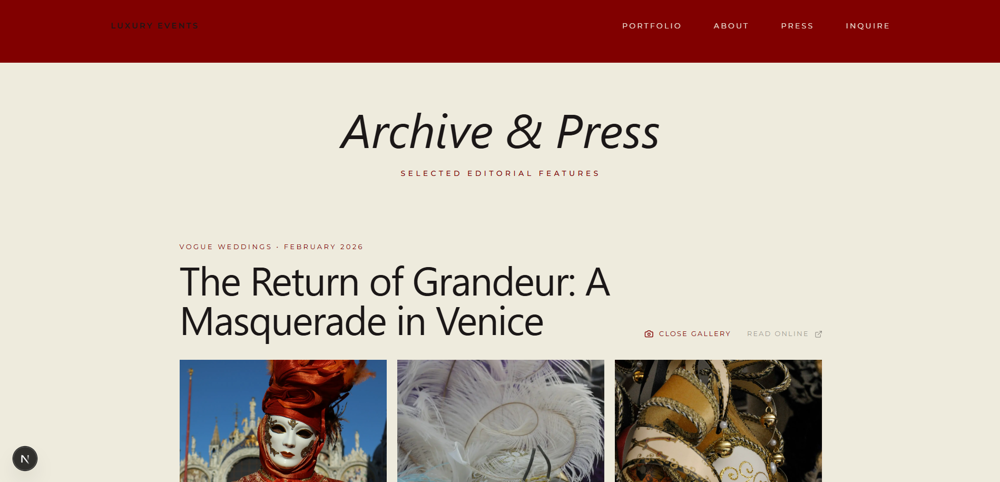
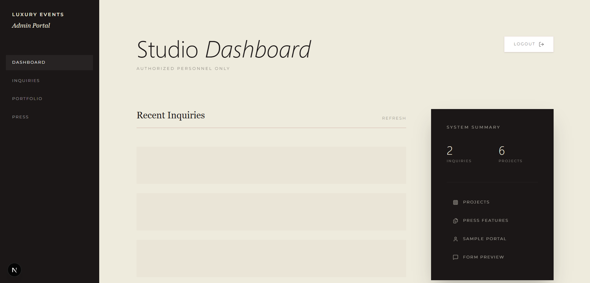

# Luxury Events Platform 🍷✨

A premium, high-end events management and portfolio platform designed for a bespoke event planning studio. This project features a sophisticated **Burgundy & Champagne** aesthetic, immersive animations, and a seamless administrative workflow.



## 🏛️ Project Vision
The Luxury Events Platform is built for a studio that values timeless elegance and meticulous production. It serves as both a public-facing editorial portfolio and a robust internal tool for lead management.

## ✨ Key Features

### 💎 Editorial Portfolio
- **Curated Showcases**: Beautifully presented event galleries with smooth hover interactions.
- **Dynamic Event Details**: Immersive pages for each signature production, featuring archival descriptions and high-resolution imagery.

### 📰 Press & Archival Media
- **Editorial Archive**: A dedicated space for media features in Vogue, Harper's Bazaar, and more.
- **"Visual Fragments" Galleries**: Interactive, expandable image grids for press highlights.
- **Live Editorial Links**: Direct access to external press coverage with verified routing.



### 📨 Bespoke Inquiry System
- **Lead Capture**: A refined inquiry form designed for high-profile client intake.
- **Admin Dashboard**: A secure, internal staff portal to manage inquiries, update statuses, and oversee archival data.



## 🎨 Design System: "Burgundy & Champagne"

| Element | Hex Code | Purpose |
| :--- | :--- | :--- |
| **Champagne** | `#EEEBDD` | Primary Background / Blush |
| **Crimson** | `#810000` | Primary Accent / Rose |
| **Burgundy** | `#630000` | Secondary Accent / Rose-Deep |
| **Charcoal** | `#1B1717` | Typography / Plum |

- **Typography**: Playfair Display (Serif) for headings; Montserrat (Sans) for structural clarity.
- **Animations**: Subtle scroll reveals and group transitions powered by GSAP and Tailwind.

## 🛠️ Technical Stack

- **Framework**: [Next.js 15](https://nextjs.org/) (App Router)
- **Database**: [Neon PostgreSQL](https://neon.tech/) (Serverless)
- **Styling**: [Tailwind CSS](https://tailwindcss.com/)
- **Icons**: [Lucide React](https://lucide.dev/)
- **Data Fetching**: Custom API Layer with `force-dynamic` routing for real-time archival consistency.

## 🚀 Getting Started

### Prerequisites
- Node.js 18.x or higher
- A Neon PostgreSQL instance

### Installation
1. Clone the repository:
   ```bash
   git clone [repository-url]
   ```
2. Install dependencies:
   ```bash
   npm install
   ```
3. Configure Environment Variables:
   Create a `.env.local` file with your Neon connection string:
   ```env
   DATABASE_URL=postgres://[user]:[password]@[host]/neondb?sslmode=require
   ```
4. Run the development server:
   ```bash
   npm run dev
   ```

---
