# InStadium Web Platform

InStadium Web is the browser-first experience of the InStadium ecosystem, built for discovery of Indian sports venues, athlete storytelling, and editorial content with integrated operational tools.

This README is intentionally architecture-first and flow-first. It provides complete high-level documentation with professional system views, while reserving focused space for deeper technical references to be added later.

## 1) Product Scope

### What this web app does

- Showcases stadiums, sports, and player narratives through public pages
- Supports QR-based stadium entry paths and deep-linked experiences
- Offers inquiry, press, and event workflows for content and operations
- Exposes server routes for data retrieval, chat, and administrative processes

### Primary user groups

- Fans and visitors exploring venues and sports
- Content and editorial contributors
- Admin users managing inquiries, events, and operational data

## 2) System Context Diagram

This context diagram shows InStadium Web as part of a larger digital ecosystem.
It highlights external users, backend services, and infrastructure dependencies.
Use this as the first architecture view before drilling into components.

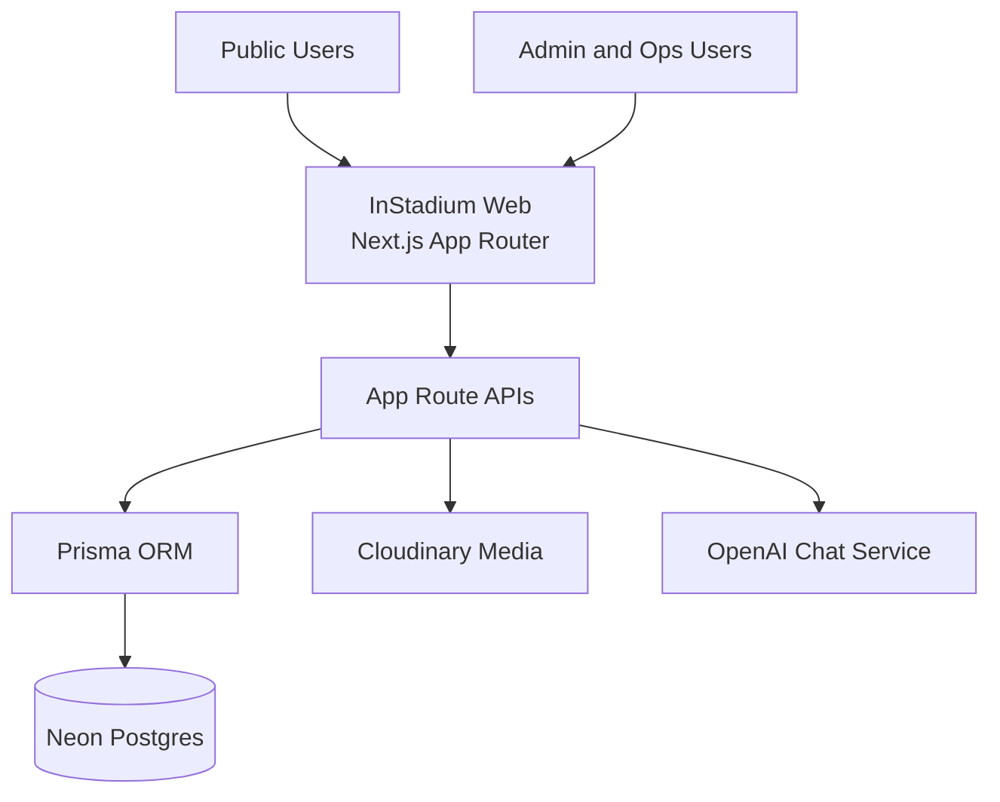

## 3) Container Architecture

This container view separates UI rendering, route handlers, and data/integration layers.
It clarifies responsibility boundaries for front-end, application API, and persistence.
It is useful for release planning and ownership mapping.

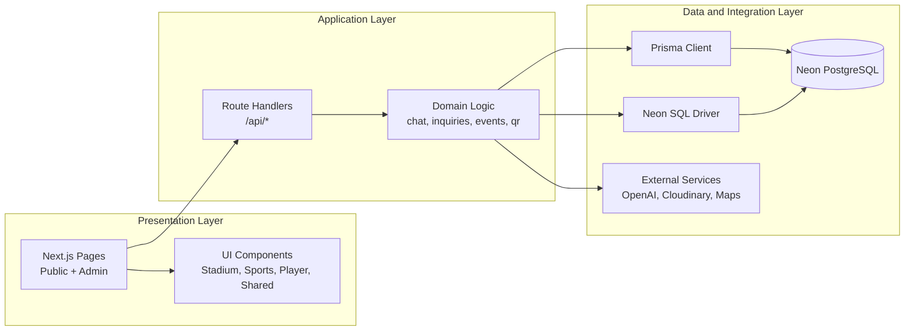

## 4) High-Level Functional Map

This map summarizes key product capabilities by user-facing functional areas.
It helps align product and engineering scope without implementation-level complexity.
Use it as a blueprint for feature planning.

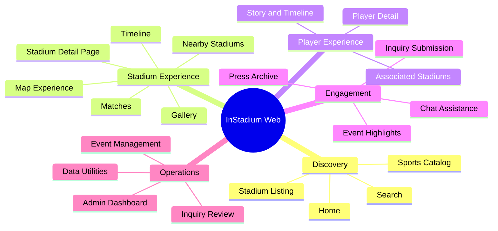

## 5) Routing Architecture

This diagram explains how public routes, dynamic pages, and API routes are organized.
It reflects the App Router structure and route-domain grouping currently used.
Use this for onboarding and navigation across the codebase.

```mermaid
flowchart TB
      root[src/app]

      root --> public[Public Pages]
      root --> dynamic[Dynamic Detail Pages]
      root --> admin[Admin Pages]
      root --> apis[API Routes]

      public --> p1[/]
      public --> p2[/sports]
      public --> p3[/stadiums]
      public --> p4[/search]
      public --> p5[/press]
      public --> p6[/inquiry]

      dynamic --> d1[/stadium/[id]]
      dynamic --> d2[/sport/[id]]
      dynamic --> d3[/player/[id]]
      dynamic --> d4[/portfolio/[id]]
      dynamic --> d5[/qr/[code]]

      admin --> a1[/admin/login]
      admin --> a2[/admin/dashboard]

      apis --> r1[/api/stadiums]
      apis --> r2[/api/sports]
      apis --> r3[/api/players]
      apis --> r4[/api/inquiries]
      apis --> r5[/api/events]
      apis --> r6[/api/press]
      apis --> r7[/api/chat]
      apis --> r8[/api/qr/resolve]
      apis --> r9[/api/debug]
```

## 6) Data Flow Diagrams

### DFD Level 0 (Context)

This diagram represents the platform as a single process and focuses on external exchanges.
It shows what data enters the system and what results are delivered back.
It intentionally avoids internal logic details.

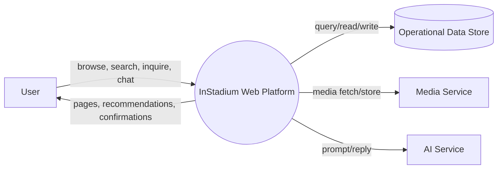

### DFD Level 1 (Operational)

This Level 1 model decomposes major flows into domain processes and storage points.
It is a practical reference for feature teams and operations alignment.
It also helps identify process dependencies for reliability planning.

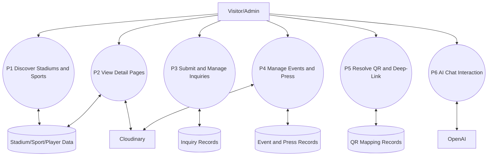

## 7) Activity Diagram: Stadium Discovery Flow

This activity flow captures the most common public journey from landing page to detailed stadium insight.
It includes search/filter loops and decision points for user refinement.
Use it as a baseline for UX and conversion improvements.

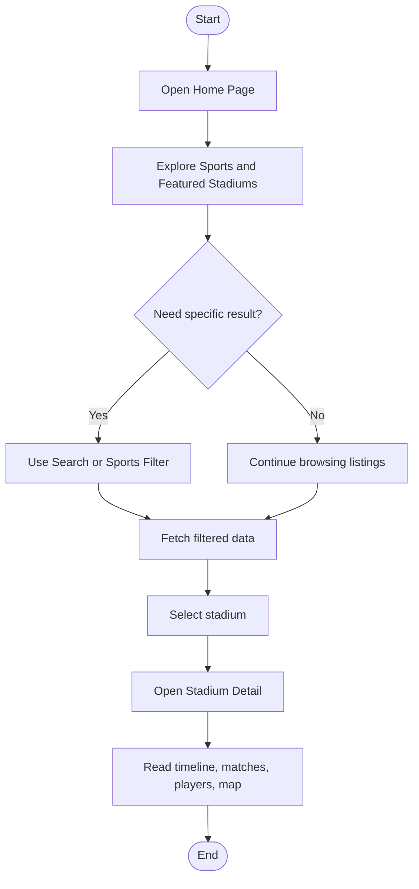

## 8) Activity Diagram: Inquiry Lifecycle

This diagram shows the business communication flow from lead submission to admin processing.
It represents the core operational loop for inquiries.
It can later be extended with status transitions and SLA milestones.

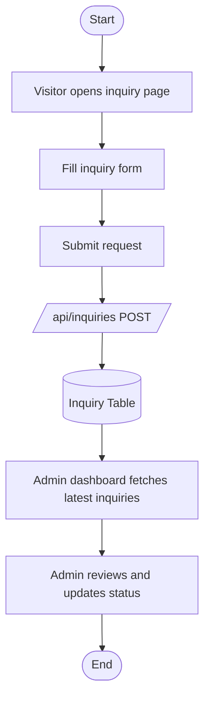

## 9) Sequence Diagram: Stadium Detail Request

This sequence illustrates how a stadium detail page is resolved at runtime.
It combines dynamic route resolution with API-driven data retrieval.
This is one of the highest-traffic core paths.

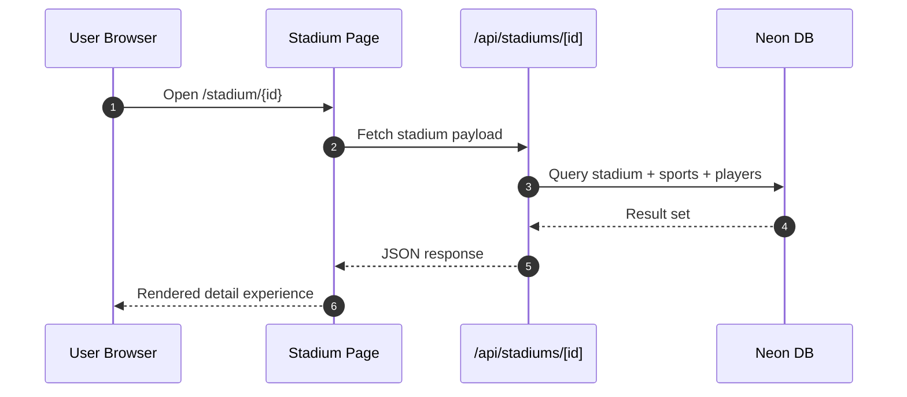

## 10) Sequence Diagram: QR Resolution Flow

This sequence describes QR code resolution used for deep-link stadium access.
It validates mapping existence and returns mapped stadium metadata.
This flow supports physical-to-digital transitions during venue visits.

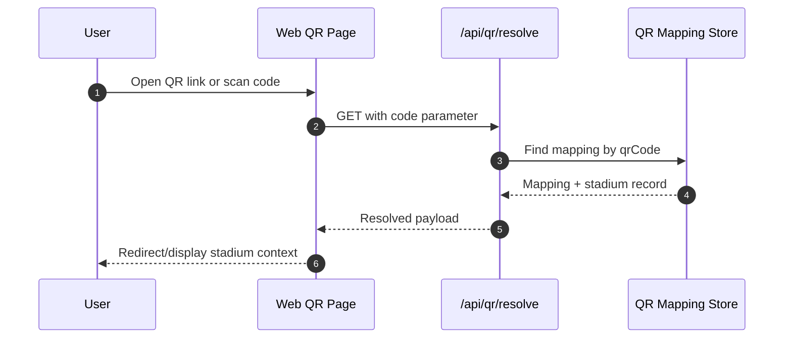

## 11) Sequence Diagram: Chat Assistance Flow

This sequence shows how user prompts are processed by the chat route.
When AI configuration is available, external model output is returned.
Fallback behavior ensures graceful responses if keys are not configured.

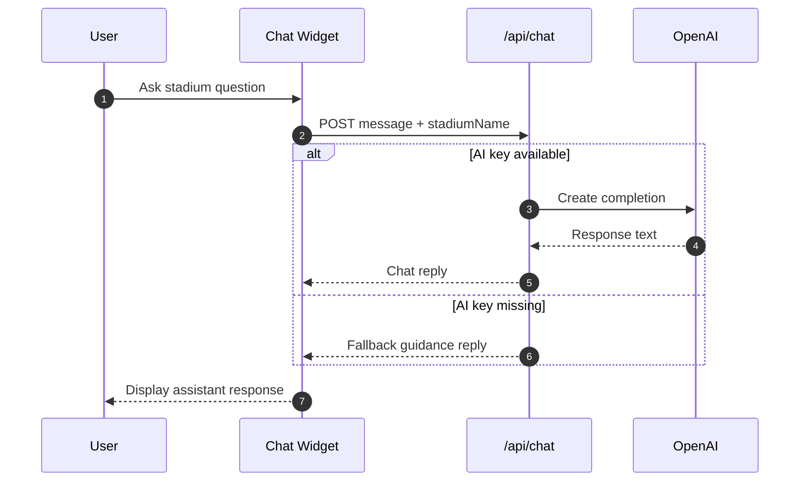

## 12) State Diagram: User Interaction States

This state model describes major user states during web usage.
It separates anonymous browsing from admin interaction and utility flows.
It is useful for access-control and navigation consistency checks.

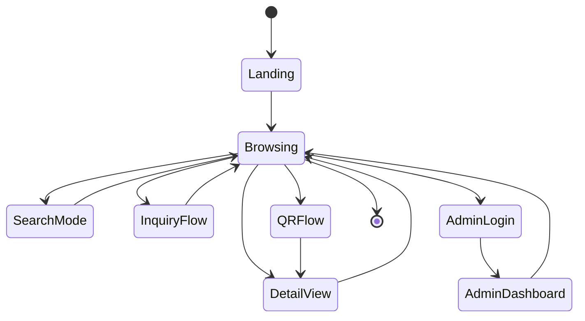

## 13) Domain ER Diagram (High-Level)

This ER view maps the primary domain entities used by the application.
It focuses on core business relationships and avoids low-level field specifics.
Use it for model understanding and future migration planning.

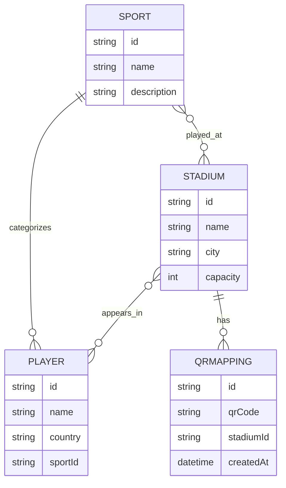

## 14) Deployment Diagram (Logical)

This diagram represents a production-style logical deployment shape.
It keeps cloud-provider details abstract while showing runtime dependencies.
Use this view for environment planning and operational coordination.

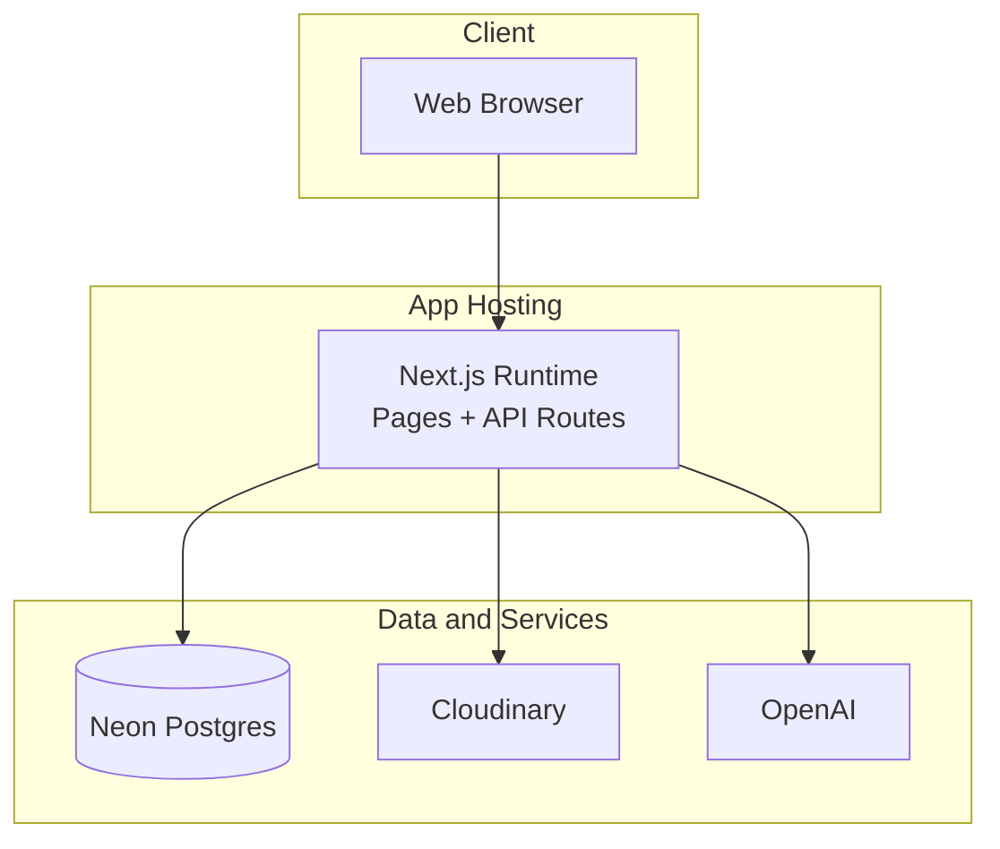

## 15) Repository Architecture

This map helps contributors quickly locate major areas of the codebase.
It reflects current organization by route, component, API, and infrastructure modules.
Use it during onboarding and feature scoping.

```mermaid
flowchart TB
      root[InStadiumWeb]
      root --> app[src/app]
      root --> comp[src/components]
      root --> lib[src/lib]
      root --> prisma[prisma]
      root --> assets[public/images]
      root --> scripts[scripts]

      app --> pages[Public and Admin Pages]
      app --> api[/api route handlers]
      comp --> stadiumComp[stadium components]
      comp --> sportsComp[sports components]
      comp --> playerComp[player components]
      lib --> dbLib[db and prisma clients]
      lib --> utilityLib[maps, cloudinary, api helpers]
```

## 16) Technical Baseline (Concise)

This section gives a production-grade summary without diving into deep implementation internals.
It is enough for architecture review, release planning, and handoff readiness.
Detailed contracts and runbooks can be added in the reserved section later.

### Stack Snapshot

- Framework: Next.js App Router
- Runtime: React + TypeScript
- Persistence: Neon PostgreSQL
- Data Access: Prisma Client and Neon serverless SQL driver
- Integrations: OpenAI chat, Cloudinary media services

### Runtime Characteristics

- API handlers use dynamic route mode for fresh data paths where required
- Domain routes are grouped by bounded context (stadiums, sports, inquiries, events, press, qr, chat)
- Data retrieval mixes ORM and SQL approaches based on use case complexity

### Security and Access (High Level)

- Public browsing APIs are available for discovery-focused features
- Admin and debug surfaces are scoped to controlled use and environment conditions
- Secret-driven integrations (database and AI/media keys) are environment-configured

### Reliability and Operations (High Level)

- Stateless API route design supports horizontally scalable deployments
- Structured route-level error responses provide operational clarity
- Data-centric operations can be monitored by route domain and environment logs

## 17) Quick Start

### Prerequisites

- Node.js 18+
- PostgreSQL connection string (Neon recommended)

### Install and Run

```bash
npm install
npm run dev
```

### Build and Start

```bash
npm run build
npm run start
```

### Minimal Environment Variables

```env
DATABASE_URL=postgres://.../neondb?sslmode=require
OPENAI_API_KEY=optional-for-chat
CLOUDINARY_CLOUD_NAME=optional
CLOUDINARY_API_KEY=optional
CLOUDINARY_API_SECRET=optional
```

## 18) Reserved Space for Deep Technical Documentation

These placeholders are intentionally left for phase-2 technical depth so this README stays clear but complete.

### 18.1 API Contracts (To Be Added)

- Endpoint request and response schemas
- Error catalog and status-code matrix
- Auth and permission matrix by route

### 18.2 Data and Schema (To Be Added)

- Full ERD with constraints and indexing strategy
- Migration policy and backward compatibility approach
- Data retention and archival standards

### 18.3 Security and Compliance (To Be Added)

- Threat model and trust boundaries
- Secret rotation and key-management standards
- Audit and monitoring controls

### 18.4 Performance and Reliability (To Be Added)

- SLO and error budget targets
- Capacity and load test strategy
- Incident response and rollback playbooks

### 18.5 CI/CD and Release Engineering (To Be Added)

- Branch and environment promotion strategy
- Quality gates and release checklist
- Rollback and hotfix policies

## 19) Documentation Status

- High-level architecture: complete
- High-level data flows: complete
- Activity and sequence modeling: complete
- Technical baseline summary: complete
- Deep technical appendix content: intentionally reserved
